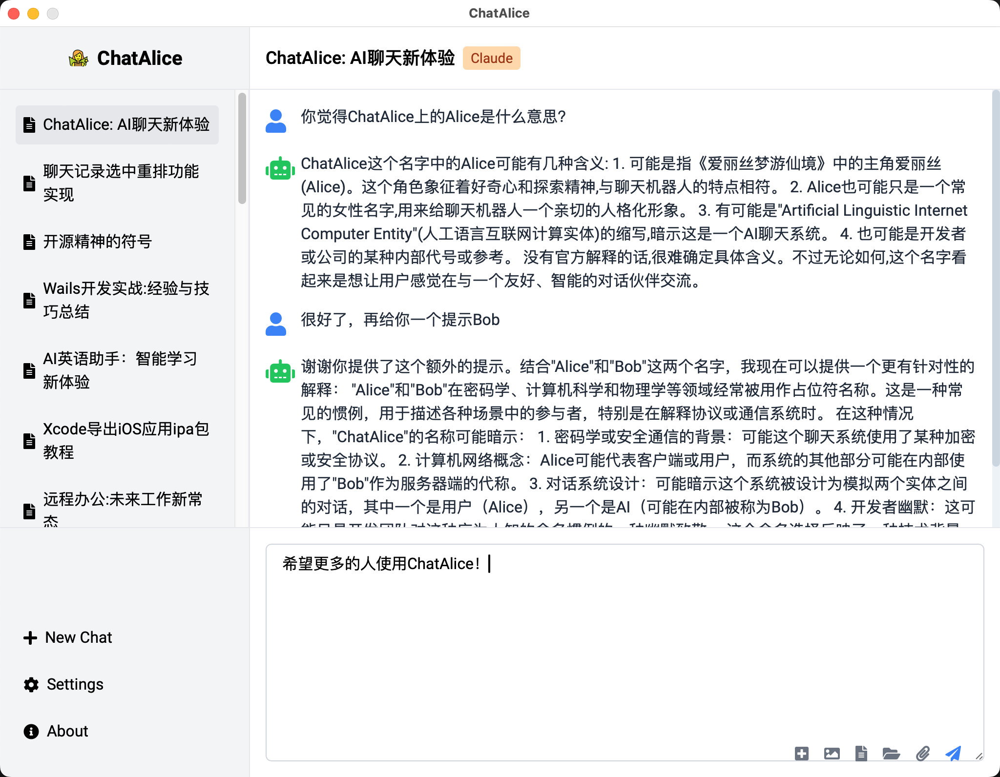

<div align="center">

# ChatAlice

ChatAlice is a powerful cross-platform desktop client supporting MacOS, Windows, and Linux desktop environments, with API integration for ChatGPT, Claude, and other large language models (LLMs).

[](https://github.com/JessonChan/chatalice/releases)
[](https://github.com/JessonChan/chatalice/releases)
[](https://github.com/JessonChan/chatalice/releases)
[](https://opensource.org/licenses/MIT)
[](http://makeapullrequest.com)

[Download](https://github.com/JessonChan/chatalice/releases) | [Documentation](link-to-docs) | [Contribute](link-to-contributing) 

[简体中文](./README.md) | [English](./README-EN.md) 



</div>

## 🏆 Sponsors

If you find ChatAlice helpful, please consider sponsoring us to support the open-source community. Your name/logo will be immortalized on our sponsors wall. The world of open-source is more wonderful with your support!

## ✨ Key Features

ChatAlice offers a rich set of features to meet your various needs for interacting with AI models:

- 🖥️ **Cross-platform compatibility**: Supports Windows, macOS, and Linux systems
- 🤖 **Multi-LLM support**: Integrates popular AI models such as ChatGPT, GPT-4, Claude, and more
- 💾 **Local conversation storage**: Permanently saves chat history, supports search and management, protects user privacy
- 🚀 **Multiple API key management**: Quickly switch between multiple API keys for different scenarios
- 📦 **Conversation export**: One-click export of chat history (supports Markdown, image, or PDF formats)
- 🔒 **Privacy protection**: All data is stored locally, ensuring your information security
- 🌐 **System proxy support**: Easily handle network connection issues
- 🌙 **Dark mode**: Protect your eyes and provide a comfortable user experience
- ⚙️ **Custom API parameters**: Flexibly adjust temperature, maximum token count, and other parameters
- 📚 **Built-in prompt library**: Helps you better interact with AI models
- 🔍 **Web search support**: Expands AI knowledge base and retrieves the latest information
- 🌍 **Multi-language interface**: Supports English, Simplified Chinese, Japanese, and other languages
- ⌨️ **Shortcut key support**: Improves operation efficiency, quickly completes common tasks
- 📎 **File import/export**: Supports drag and drop files, easily import and export conversation content
- 🎨 **Modern UI**: Intuitive interface built with Vue 3 and Tailwind CSS
- ⚡ **High performance**: Backend developed in Go language, ensuring a smooth user experience

## ⚡️ Quick Start

1. Visit the [GitHub Releases](https://github.com/JessonChan/chatalice/releases) page to download the latest version
2. Install ChatAlice on your device
3. Launch the application and configure your LLM API key
4. Select the AI model you want to interact with
5. Start conversing with AI!

For detailed installation and usage guides, please refer to our [User Manual](./docs/user-installation.md).

## 🚀 Development Guide

We welcome developers to participate in improving and expanding ChatAlice. Here are the steps to start development:

### Prerequisites

- Wails CLI
   - Go 1.20+
   - NPM (Node 15+)

### Build Steps

1. Clone the repository
   ```bash
   git clone https://github.com/JessonChan/chatalice.git
   cd chatalice
   ```

2. Run in development mode
   ```bash
   wails dev
   ```

3. Build the application
   ```bash
   wails build
   ```

For more details, including code standards and architecture explanations, please check our [Developer Guide](./docs/todo.md).

## 🤝 Contribution Guidelines

We appreciate and welcome all forms of contributions! You can participate in the following ways:

- 🐛 Report issues and bugs
- 💡 Suggest new features
- 📝 Improve documentation or provide translations
- 🔧 Submit code fixes or new features
- 👀 Review source code changes

Every contribution, big or small, is valuable. We especially encourage new developers to participate, as it's a great opportunity to enhance skills and gain experience.

For detailed contribution processes and guidelines, please check our [Contribution Guide](./docs/todo.md).

## 🙋 Support and Help

If you encounter any problems or have any questions during use, you can seek help through the following ways:

- Consult our [Frequently Asked Questions (FAQ)](link-to-faq)
- [Submit an issue](https://github.com/JessonChan/chatalice/issues/new) on GitHub

## 💖 Sponsorship

ChatAlice is a community-driven open-source project, and we rely on your support to sustain the project's development. You can support us in the following ways:

- 🏅 Become a sponsor
- ⭐ Give the project a star

As a sponsor, you will receive:

- 🏆 Special acknowledgment on the project website and GitHub repository
- 🔮 Appropriate introduction for your project and company
- 💼 Priority technical support

All sponsorship funds will be used to maintain and upgrade project infrastructure, support core team members' development work, and organize community events.

Check our [Sponsorship Page](./docs/sponsers.md) for more details, or contact @JessonChan to discuss custom sponsorship options.

## 🗺️ Roadmap

We are continuously improving ChatAlice. Here are some features we have planned:

- [ ] Voice input and output functionality
- [ ] Advanced conversation management system
- [ ] Plugin system supporting community extensions
- [ ] Integration of more AIGC models (text, image, video)
- [ ] Advanced data analysis and visualization features

We welcome community members to participate in discussing the future direction of the project. Visit our [Project Planning](./docs/todo.md) page to learn more details and share your ideas.

## 📜 License

ChatAlice is licensed under the [MIT License](./LICENSE).

## 🙏 Acknowledgments

Thanks to the following open-source projects for their contributions, which made the development of ChatAlice possible:

- [Wails](https://wails.io/)
- [Go](https://golang.org/)
- [Vue.js](https://vuejs.org/)
- [Tailwind CSS](https://tailwindcss.com/)
- [GORM](https://github.com/go-gorm/gorm)

And many more projects that we cannot list individually. Thank you, open source: 👨‍💻 👩‍💻 🐧 Open Source is changing the world!

---

<div align="center">
  Made with ❤️ | Copyright © 2024-present ChatAlice Team

  If you like the ChatAlice project, please give us a star ⭐ to support us!
</div>