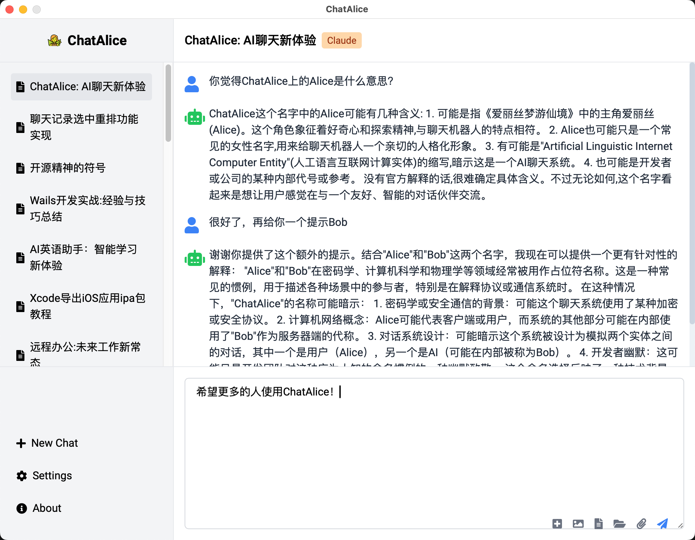

<div align="center">

# ChatAlice

ChatAlice 是一个功能强大的跨平台桌面客户端，支持MacOS、Windows和Linux桌面环境，支持 ChatGPT、Claude 和其他大型语言模型（LLMs）的API接入。

[](https://github.com/JessonChan/chatalice/releases)
[](https://github.com/JessonChan/chatalice/releases)
[](https://github.com/JessonChan/chatalice/releases)
[](https://opensource.org/licenses/MIT)
[](http://makeapullrequest.com)

[下载](https://github.com/JessonChan/chatalice/releases) | [文档](link-to-docs) | [贡献](link-to-contributing) 

[简体中文](./README.md) | [English](./README-EN.md) 



</div>

##  🏆 Sponsors

如果你觉得ChatAlice 帮助了您，请考虑赞助我们以支持开源社区，您的名字/logo 将被铭记在我们的赞助者墙上，开源的世界更精彩! 

## ✨ 主要特性

ChatAlice 提供了丰富的功能，满足您与 AI 模型交互的各种需求：

- 🖥️ **跨平台兼容**：支持 Windows、macOS 和 Linux 系统
- 🤖 **多 LLM 支持**：集成 ChatGPT、GPT-4、Claude 等多种流行的 AI 模型
- 💾 **本地对话存储**：永久保存聊天记录，支持搜索和管理，保护用户隐私
- 🚀 **多 API 密钥管理**：快速切换多个 API 密钥，灵活应对不同场景
- 📦 **对话导出**：一键导出聊天记录（支持 Markdown、图片或 PDF 格式）
- 🔒 **隐私保护**：所有数据都存储在本地，确保您的信息安全
- 🌐 **系统代理支持**：轻松处理网络连接问题
- 🌙 **深色模式**：保护您的眼睛，提供舒适的使用体验
- ⚙️ **自定义 API 参数**：灵活调整温度、最大令牌数等参数
- 📚 **内置提示词库**：助您更好地与 AI 模型互动
- 🔍 **联网搜索支持**：扩展 AI 的知识面，获取最新信息
- 🌍 **多语言界面**：支持英语、简体中文、日语等多种语言
- ⌨️ **快捷键支持**：提高操作效率，快速完成常用任务
- 📎 **文件导入/导出**：支持拖放文件，轻松导入导出对话内容
- 🎨 **现代化 UI**：基于 Vue 3 和 Tailwind CSS 构建的直观界面
- ⚡ **高性能**：使用 Go 语言开发的后端，确保流畅的用户体验


## ⚡️ 快速开始

1. 访问 [GitHub Releases](https://github.com/JessonChan/chatalice/releases) 页面下载最新版本
2. 安装 ChatAlice 到您的设备
3. 启动应用程序并配置您的大模型 API 密钥
4. 选择想要交互的 AI 模型
5. 开始与 AI 进行对话！

详细的安装和使用指南，请参阅我们的[用户手册](./docs/user-installation.md)。

## 🚀 开发指南

我们欢迎开发者参与 ChatAlice 的改进和扩展。以下是开始开发的步骤：

### 前置需求

- Wails CLI
   - Go 1.20+
   - NPM (Node 15+)

### 构建步骤

1. 克隆仓库
   ```bash
   git clone https://github.com/JessonChan/chatalice.git
   cd chatalice
   ```

2. 开发模式运行
   ```bash
   wails dev
   ```

3. 构建应用
   ```bash
   wails build
   ```

更多详细信息，包括代码规范、架构说明等，请查看我们的[开发者指南](./docs/todo.md)。

## 🤝 贡献指南

我们感谢并欢迎各种形式的贡献！您可以通过以下方式参与：

- 🐛 报告问题和漏洞
- 💡 提出新功能建议
- 📝 改进文档或提供翻译
- 🔧 提交代码修复或新功能
- 👀 审查源代码变更

每一份贡献，无论大小，都是宝贵的。我们尤其鼓励新手开发者参与，这是提升技能、积累经验的绝佳机会。

详细的贡献流程和指南，请查看我们的[贡献指南](./docs/todo.md)。

## 🙋 支持与帮助

如果您在使用过程中遇到任何问题或有任何疑问，可以通过以下方式寻求帮助：

- 查阅我们的[常见问题解答（FAQ）](link-to-faq)
- 在 GitHub 上[提交 issue](https://github.com/JessonChan/chatalice/issues/new)

## 💖 赞助

ChatAlice 是一个社区驱动的开源项目，我们依靠您的支持来维持项目的发展。您可以通过以下方式支持我们：

- 🏅 成为赞助者
- ⭐ 给项目一个 star

成为赞助商，您将获得：

- 🏆 项目官网及 GitHub 仓库的特别鸣谢
- 🔮 为您的项目及公司进行适当介绍
- 💼 优先的技术支持

所有赞助资金将用于维护和升级项目基础设施、支持核心团队成员的开发工作，以及组织社区活动。

查看我们的[赞助页面](./docs/sponsers.md)了解更多详情，或联系 @JessonChan 商讨定制赞助方案。

## 🗺️ 路线图

我们正在不断改进 ChatAlice，以下是我们计划中的一些功能：

- [ ] 语音输入和输出功能
- [ ] 高级对话管理系统
- [ ] 插件系统，支持社区扩展
- [ ] 更多 AIGC 模型的集成（文图视频）
- [ ] 高级数据分析和可视化功能

我们欢迎社区成员参与讨论项目的未来方向。访问我们的[项目规划](./docs/todo.md)页面，了解更多细节并分享您的想法。

## 📜 许可证

ChatAlice 采用 [MIT 许可证](./LICENSE)。

## 🙏 致谢

感谢以下开源项目的贡献，它们使得 ChatAlice 的开发成为可能：

- [Wails](https://wails.io/)
- [Go](https://golang.org/)
- [Vue.js](https://vuejs.org/)
- [Tailwind CSS](https://tailwindcss.com/)
- [GORM](https://github.com/go-gorm/gorm)

还有更多项目无法一一感谢，感谢开源:  👨‍💻 👩‍💻 🐧 Open Source is changing the world!

---

<div align="center">
  用 ❤️ 制作 | Copyright © 2024-present ChatAlice Team

  如果您喜欢 ChatAlice 项目，请给我们一个星标 ⭐ 支持我们！
</div>